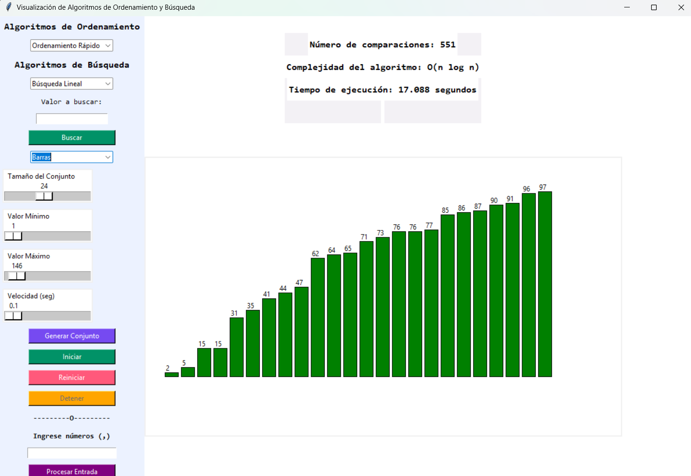
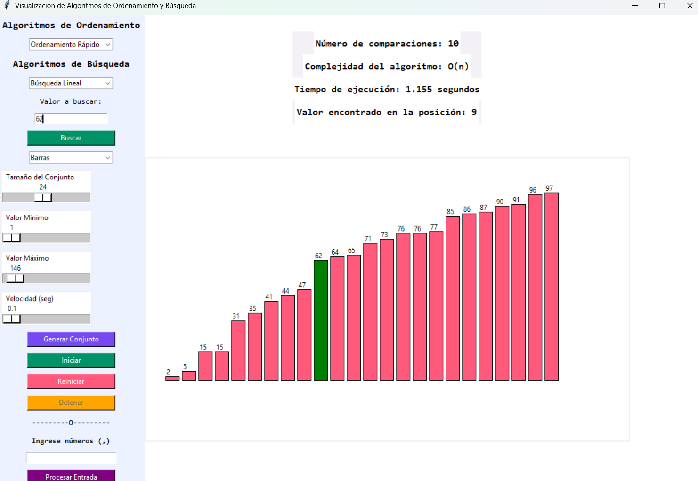

# Visualización de Algoritmos de Ordenamiento y Búsqueda

# Sorting and Searching Algorithms Visualization

## Descripción / Description

Este proyecto es una aplicación interactiva que permite visualizar diferentes algoritmos de ordenamiento y búsqueda en tiempo real. La interfaz gráfica permite a los usuarios experimentar con diferentes conjuntos de datos y observar cómo funcionan los algoritmos paso a paso.

This project is an interactive application that allows users to visualize different sorting and searching algorithms in real-time. The graphical interface enables users to experiment with different data sets and observe how the algorithms work step by step.

## Características / Features

- Visualización en tiempo real de algoritmos de ordenamiento
- Múltiples tipos de visualización (barras, líneas, puntos)
- Control de velocidad de animación
- Generación aleatoria de datos
- Entrada manual de datos
- Algoritmos de ordenamiento implementados:
  - Ordenamiento Burbuja (Bubble Sort)
  - Ordenamiento Rápido (Quick Sort)
  - Ordenamiento por Inserción (Insertion Sort)
  - Ordenamiento por Selección (Selection Sort)
  - Ordenamiento por Mezcla (Merge Sort)
- Algoritmos de búsqueda implementados:
  - Búsqueda Lineal
  - Búsqueda Binaria
- Estadísticas de rendimiento:
  - Número de comparaciones
  - Tiempo de ejecución
  - Complejidad del algoritmo

## Requisitos / Requirements

- Python 3.x
- Tkinter (incluido en la instalación estándar de Python)
- Bibliotecas estándar de Python (random, time)

## Instalación / Installation

1. Clona este repositorio:
```bash
git clone [URL_DEL_REPOSITORIO]
```

2. Navega al directorio del proyecto:
```bash
cd AlgoritmosDeOrdenamiento
```

3. (Opcional) Crea un entorno virtual:
```bash
python -m venv .venv
source .venv/bin/activate  # En Windows: .venv\Scripts\activate
```

4. Ejecuta el programa:
```bash
python main.py
```

## Uso / Usage

1. Selecciona el tipo de visualización (barras, líneas o puntos)
2. Genera un conjunto de datos aleatorio o ingresa tus propios datos
3. Selecciona el algoritmo de ordenamiento o búsqueda
4. Ajusta la velocidad de la animación según lo desees
5. Presiona "Iniciar" para comenzar la visualización
6. Observa las estadísticas de rendimiento en tiempo real

## Capturas de Pantalla / Screenshots

### Interfaz Principal / Main Interface


### Visualización de Algoritmos / Algorithm Visualization


## Contribución / Contributing

Las contribuciones son bienvenidas. Por favor, abre un issue para discutir los cambios que te gustaría hacer.

Contributions are welcome. Please open an issue to discuss the changes you would like to make.
